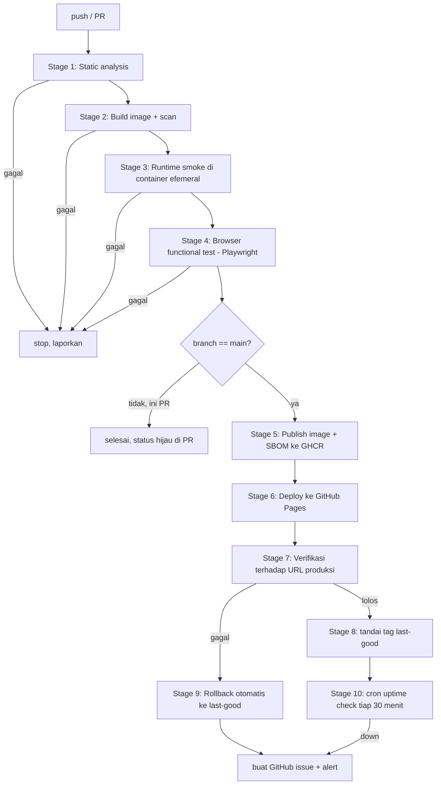

# Spesifikasi Pipeline End-to-End Otomatis (versi gratis)

Dokumen desain untuk melengkapi pipeline BudgetTracker dari **CI saja** menjadi
**commit → live di internet → terverifikasi → rollback otomatis**, tanpa biaya.

Ini spesifikasi, bukan implementasi. Kode akan ditulis terpisah; tiap stage di
bawah sudah dilengkapi kriteria lolos/gagal supaya bisa dinilai objektif.

---

## 1. Definisi "end-to-end automated"

Sebuah pipeline disebut end-to-end otomatis kalau **semua** ini benar:

| Kriteria | Status sekarang | Target |
|---|---|---|
| Commit memicu build tanpa tangan manusia | sudah | tetap |
| Ada gate kualitas yang bisa menggagalkan rilis | sebagian (smoke test saja) | 6 gate |
| Artefak versi ter-publikasi & bisa dilacak (digest) | sebagian (tag SHA) | + digest & SBOM |
| **Deploy ke lingkungan hidup tanpa tangan manusia** | **belum ada** | ada |
| **Verifikasi setelah deploy, terhadap URL produksi** | **belum ada** | ada |
| **Rollback otomatis saat verifikasi gagal** | **belum ada** | ada |
| Pemantauan berkelanjutan setelah rilis | belum ada | cron + alert |

Tiga baris tebal itulah yang membuat pipeline sekarang belum layak disebut
end-to-end. Dokumen ini menutup ketiganya.

---

## 2. Target deploy gratis

Aplikasinya statis, jadi **hosting statis adalah jalur paling tepat sekaligus
paling gratis**. Container tetap dipertahankan sebagai jalur kedua karena itu
yang melatih skill orkestrasi.

| Opsi | Biaya | Perlu kartu kredit | Auto-deploy dari CI | Catatan |
|---|---|---|---|---|
| **GitHub Pages** (jalur utama) | gratis untuk repo publik | tidak | native (`actions/deploy-pages`) | HTTPS otomatis, tanpa cold start |
| Cloudflare Pages | gratis | tidak | ya (wrangler) | dapat preview URL per-PR — kelebihan yang Pages tidak punya |
| Render (web service, Docker) | ada tier gratis | tidak | ya (deploy hook) | **spin-down saat idle → cold start lambat** |
| Oracle Cloud Always Free | gratis permanen | **ya** | via SSH | VM penuh, kontrol total, setup paling berat |

**Keputusan: GitHub Pages sebagai produksi, jalur container opsional ke Render.**
Alasannya: Pages tidak butuh akun pihak ketiga, tidak butuh kartu, tidak ada
cold start, dan `deploy-pages` sudah punya integrasi environment + approval di
GitHub sendiri. Jalur container disiapkan sebagai *opt-in* lewat
`workflow_dispatch`, bukan di jalur utama, supaya kegagalan pihak ketiga tidak
memblokir rilis.

> **Verifikasi dulu sebelum implementasi.** Syarat tier gratis semua layanan di
> atas berubah cukup sering, dan pengetahuanku bisa tertinggal. Cek halaman
> harga masing-masing saat mulai mengerjakan. Yang paling kecil risikonya
> berubah adalah GitHub Pages untuk repo publik.

> **Konsekuensi repo publik.** Pages gratis, Actions menit tak terbatas, dan
> *required reviewers* pada environment hanya berlaku untuk repo publik. Repo
> ini tidak boleh berisi data pribadi — aman, karena BudgetTracker menyimpan
> semua data di `localStorage` browser, bukan di repo. **Ini berbeda dari
> SiPENA**, yang punya PII asli di `natriumdb.db`; jangan pernah pakai pola
> repo-publik ini untuk SiPENA.

---

## 3. Peta alur

Pemisahan file workflow:

| File | Trigger | Isi |
|---|---|---|
| `.github/workflows/ci.yml` | `pull_request`, `push` ke non-main | Stage 1–4 |
| `.github/workflows/release.yml` | `push` ke `main` | Stage 1–9 |
| `.github/workflows/monitor.yml` | `schedule` (cron), `workflow_dispatch` | Stage 10 |
| `.github/workflows/rollback.yml` | `workflow_dispatch` (input: SHA) | Stage 9 manual |
| `.github/workflows/deploy-container.yml` | `workflow_dispatch` | jalur Render opsional |

Alasan dipisah: PR tidak boleh punya akses tulis ke registry maupun Pages, dan
`release.yml` butuh permission yang lebih besar. Menggabungkan keduanya memaksa
satu file punya permission maksimum untuk semua kasus.

---

## 4. Stage 0 — Bootstrap (sekali saja, manual)

Prasyarat yang belum ada saat ini.

| Item | Perintah / aksi |
|---|---|
| Folder belum jadi git repo | `git init && git branch -M main` |
| Belum ada remote | `gh repo create budgettracker-deploy --public --source=. --push` |
| Pages belum aktif | `gh api -X POST repos/{owner}/{repo}/pages -f build_type=workflow` atau lewat Settings → Pages → Source: **GitHub Actions** |
| Belum ada `package.json` | dibutuhkan Stage 4 untuk Playwright |
| Branch protection | wajibkan status check Stage 1–4 sebelum merge ke `main` |
| Environment `production` | opsional: aktifkan required reviewer kalau ingin gate manual |

**GATE 0 — kriteria lolos:**
- `git remote -v` menunjukkan remote GitHub
- `gh api repos/{owner}/{repo}/pages` mengembalikan 200 dengan `"build_type": "workflow"`
- `gh repo view --json visibility` = `PUBLIC`

**Gagal → berhenti.** Semua stage lain bergantung pada ini.

---

## 5. Stage 1 — Static analysis

**Trigger:** PR dan push. **Input:** working tree. **Butuh jaringan:** hanya untuk unduh linter.

| # | Alat | Yang diperiksa | Lolos jika |
|---|---|---|---|
| 1.1 | `hadolint` | Dockerfile: base image ter-pin, tidak ada `apt-get upgrade`, `USER` diset | exit 0, tanpa `error`/`warning` |
| 1.2 | `actionlint` | sintaks workflow, ekspresi `${{ }}`, nama action valid | exit 0 |
| 1.3 | `yamllint` | `docker-compose.yml`, semua workflow | exit 0 (relaxed: line-length off) |
| 1.4 | `shellcheck` | `tests/smoke.sh` | exit 0, severity ≥ warning |
| 1.5 | `gitleaks` | seluruh riwayat git: API key, token, private key | 0 temuan |
| 1.6 | `nginx -t` | `nginx.conf` valid secara sintaksis | exit 0 — jalankan di dalam image nginx, bukan di runner |
| 1.7 | `html5validator` atau `tidy` | `public/index.html` parse tanpa error fatal | 0 error fatal (warning boleh) |
| 1.8 | **deploybot drift check** | `python deploybot.py generate . --offline` lalu `git diff --exit-code` | tidak ada diff |

Catatan 1.6: `nginx -t` tidak bisa dijalankan langsung di runner karena nginx
tidak terpasang. Jalankan lewat
`docker run --rm -v $PWD/nginx.conf:/etc/nginx/conf.d/default.conf:ro nginxinc/nginx-unprivileged:1.27-alpine nginx -t`.
Ini menangkap salah ketik di config yang jika lolos akan membuat container gagal
start di produksi — kelas bug yang smoke test saja terlambat menangkapnya.

Catatan 1.8 adalah gate yang mengikat proyek 3 ke proyek 1: kalau seseorang
mengedit `Dockerfile` dengan tangan tapi tidak memperbarui template deploybot,
atau sebaliknya, CI menggagalkannya. **Gate ini hanya masuk akal kalau kedua
project ada di satu repo atau deploybot dipasang sebagai dependency.** Kalau
dipisah, tandai gate ini `continue-on-error: true` dulu, atau tunda.

**GATE 1:** semua sub-langkah exit 0. Satu saja gagal → job merah, PR tidak
bisa di-merge (lewat branch protection). **Artefak:** laporan gitleaks (SARIF).

---

## 6. Stage 2 — Build & scan image

| # | Langkah | Lolos jika |
|---|---|---|
| 2.1 | `docker build` dengan cache Actions (`type=gha`) | exit 0 |
| 2.2 | Catat digest: `docker inspect --format '{{index .RepoDigests 0}}'` | digest tercatat di job summary |
| 2.3 | **Budget ukuran image** | ≤ 80 MB uncompressed. Di atas itu → gagal |
| 2.4 | `trivy image --severity HIGH,CRITICAL --ignore-unfixed --exit-code 1` | 0 kerentanan HIGH/CRITICAL yang **sudah ada perbaikannya** |
| 2.5 | `docker sbom` / `syft` → SBOM format SPDX | file SBOM terbentuk |

Alasan `--ignore-unfixed`: kerentanan tanpa patch tersedia tidak bisa kamu
perbaiki, jadi menggagalkan build karenanya hanya melatih orang untuk
meng-abaikan gate. Yang punya patch = utang yang bisa dibayar hari ini.

Alasan budget ukuran (2.3): image nginx-alpine + satu file HTML seharusnya
jauh di bawah 80 MB. Kalau tiba-tiba membengkak, artinya `.dockerignore` bocor
dan ada yang tidak seharusnya masuk — misalnya `.git`, `node_modules`, atau
file `.docx`. Ini gate yang menangkap kebocoran isi image, bukan sekadar
efisiensi.

**GATE 2:** 2.1, 2.3, 2.4 wajib hijau. **Artefak:** SBOM, laporan Trivy (SARIF
→ upload ke tab Security), digest image.

---

## 7. Stage 3 — Runtime smoke (container efemeral)

Jalankan container di runner, uji dari luar. Perluasan `tests/smoke.sh` yang
sudah ada.

| # | Assertion | Lolos jika |
|---|---|---|
| 3.1 | `/healthz` → 200 `ok` | sudah ada |
| 3.2 | `/` memuat app shell (`FinanceFlow` ada di HTML) | sudah ada |
| 3.3 | Header keamanan terkirim (`X-Content-Type-Options`) | sudah ada |
| 3.4 | Rute tak dikenal → 200 (SPA fallback), bukan 404 | sudah ada |
| 3.5 | **Container tidak jalan sebagai root**: `docker exec <c> id -u` | output ≠ `0` |
| 3.6 | **HEALTHCHECK melaporkan `healthy`** dalam 40 detik | `docker inspect --format '{{.State.Health.Status}}'` = `healthy` |
| 3.7 | **Tidak crash-loop**: `RestartCount` setelah 30 detik | `0` |
| 3.8 | **Read-only rootfs benar-benar jalan**: start dengan `--read-only` + tmpfs seperti di compose | container tetap `healthy` |
| 3.9 | Respons gzip untuk `/` saat `Accept-Encoding: gzip` | header `Content-Encoding: gzip` |

3.5–3.8 adalah tambahan penting: klaim "non-root" dan "read-only" di
`docker-compose.yml` saat ini **belum pernah diuji**. Gate ini mengubahnya dari
niat menjadi fakta terverifikasi.

**GATE 3:** semua 9 assertion lolos. **Gagal → `docker logs` di-upload sebagai
artefak** sebelum job berhenti.

---

## 8. Stage 4 — Browser functional test (Playwright)

Ini gate yang sekarang **sama sekali tidak ada**, dan yang paling berharga:
Stage 3 hanya membuktikan server menyajikan HTML, bukan bahwa aplikasinya
berfungsi.

Playwright (Chromium headless) menyerang container yang sama dari Stage 3.

| # | Skenario | Assertion |
|---|---|---|
| 4.1 | Halaman dimuat tanpa error konsol | 0 pesan `console.error`, 0 uncaught exception |
| 4.2 | Chart.js ter-render | ada `<canvas>` dengan ukuran > 0, dan `window.Chart` terdefinisi |
| 4.3 | **Tambah transaksi** | isi form → item baru muncul di daftar; saldo berubah sesuai |
| 4.4 | **Persistensi `localStorage`** | reload halaman → transaksi dari 4.3 masih ada; ada key ber-prefix `ff_` |
| 4.5 | **Budget per kategori** | set limit → progres terhadap limit tampil |
| 4.6 | **Recurring item** | tambah item berulang → muncul di daftarnya |
| 4.7 | Ganti tema gelap/terang | atribut/class tema berubah, dan tetap bertahan setelah reload |
| 4.8 | Ganti bahasa EN ↔ ID | teks UI berubah, pilihan bertahan setelah reload |
| 4.9 | Responsif | viewport 375px: tidak ada scroll horizontal pada `body` |
| 4.10 | **OCR struk (non-blocking)** | `window.Tesseract` terdefinisi. **`continue-on-error: true`** |

**4.10 sengaja tidak memblokir rilis.** Tesseract.js diunduh dari unpkg saat
runtime; kalau unpkg sedang bermasalah, itu bukan regresi kodemu dan tidak
boleh menghentikan deploy. Tapi hasilnya tetap dilaporkan supaya kelihatan.

**Ini juga menyingkap risiko arsitektur yang nyata:** aplikasi ini bisa rusak di
produksi tanpa satu baris kode pun berubah, karena dua library-nya ditarik dari
CDN pihak ketiga. Rekomendasi backlog: vendor Chart.js dan Tesseract.js ke
`public/vendor/`. Setelah itu CSP yang ketat juga jadi mungkin — dua masalah
selesai sekaligus.

**GATE 4:** 4.1–4.9 lolos. **Artefak:** screenshot + trace Playwright untuk tiap
kegagalan, dan rekaman video untuk 4.3–4.4.

---

## 9. Stage 5 — Publish (hanya `main`)

| # | Langkah | Lolos jika |
|---|---|---|
| 5.1 | Login GHCR dengan `GITHUB_TOKEN` (bukan PAT) | sukses |
| 5.2 | Push tag `:<sha7>` dan `:latest` | keduanya ter-push |
| 5.3 | Lampirkan SBOM ke image | ter-attach |
| 5.4 | **Verifikasi image bisa ditarik ulang by digest** dari registry | `docker pull <repo>@<digest>` sukses |

5.4 penting: push yang "sukses" tapi menghasilkan image korup atau manifest
salah arsitektur baru terlihat saat orang lain menariknya. Tarik ulang di CI
membuktikan artefaknya benar-benar bisa dipakai.

**GATE 5:** 5.2 dan 5.4 hijau.

---

## 10. Stage 6 — Deploy ke produksi (GitHub Pages)

| # | Langkah | Catatan |
|---|---|---|
| 6.1 | `actions/configure-pages` | |
| 6.2 | `actions/upload-pages-artifact` dengan `path: public/` | isi `public/` **persis** yang diuji di Stage 3–4 |
| 6.3 | `actions/deploy-pages` dalam `environment: production` | keluarkan `page_url` sebagai output |
| 6.4 | `concurrency: group: pages, cancel-in-progress: false` | jangan batalkan deploy yang sedang jalan |

Permission minimum: `pages: write`, `id-token: write`, `contents: read`.

**Perbedaan penting yang harus disadari:** yang di-deploy ke Pages adalah isi
`public/`, **bukan image container** yang dibangun di Stage 2. Artinya image itu
berfungsi sebagai *lingkungan uji* dan artefak rilis yang bisa dilacak, bukan
yang benar-benar melayani produksi. Ini konsisten (sumbernya satu file yang
sama), tapi jangan diklaim sebagai "deploy container ke produksi" — bukan.

Kalau kamu ingin container yang benar-benar melayani produksi, itu jalur
`deploy-container.yml` (Render) di bagian 15.

**GATE 6:** `deploy-pages` sukses dan `page_url` tidak kosong.

---

## 11. Stage 7 — Verifikasi pasca-deploy (terhadap URL produksi)

Gate yang membedakan "sudah ter-deploy" dari "sudah benar-benar jalan".

| # | Langkah | Lolos jika |
|---|---|---|
| 7.1 | Tunggu propagasi: poll `page_url` tiap 5 detik | HTTP 200 dalam ≤ 120 detik |
| 7.2 | Cek konten benar-benar versi baru | HTML produksi mengandung marker build (lihat catatan) |
| 7.3 | Jalankan ulang **subset smoke.sh** terhadap URL live | 3.1–3.4 lolos (kecuali `/healthz`, lihat catatan) |
| 7.4 | Jalankan ulang **Playwright** terhadap URL live | 4.1–4.9 lolos |
| 7.5 | Cek HTTPS & sertifikat valid | `curl --fail` tanpa `-k` |

Catatan 7.2: butuh **marker build**. Cara termurah: langkah build menyuntikkan
komentar HTML `<!-- build: <sha> -->` ke `public/index.html` sebelum upload.
Tanpa ini, kamu tidak bisa membedakan "deploy berhasil" dari "CDN masih
menyajikan versi lama", dan verifikasi jadi bohong.

Catatan 7.3: `/healthz` **tidak akan ada** di Pages — itu endpoint nginx, dan
Pages bukan nginx milikmu. Jadi smoke.sh harus punya mode `--target=pages` yang
melewati assertion khusus-container. Kalau ini dilewatkan, Stage 7 akan selalu
gagal dan memicu rollback palsu terus-menerus.

**GATE 7:** semua lolos → lanjut Stage 8. Ada yang gagal → **langsung Stage 9
(rollback)**, jangan berhenti dalam keadaan rusak.

---

## 12. Stage 8 — Tandai versi baik

| # | Langkah |
|---|---|
| 8.1 | Update tag git `last-good` ke SHA yang baru diverifikasi (force-push tag) |
| 8.2 | Tulis ringkasan ke `$GITHUB_STEP_SUMMARY`: SHA, digest, URL, durasi tiap stage |
| 8.3 | Simpan `page_url` + SHA sebagai artefak/variabel repo untuk dipakai monitor |

Tag `last-good` adalah satu-satunya sumber kebenaran untuk rollback. Karena
aplikasinya statis, checkout tag itu dan deploy ulang **dijamin** menghasilkan
kondisi yang sama — properti yang tidak dimiliki aplikasi ber-database.

---

## 13. Stage 9 — Rollback otomatis

**Pemicu:** Stage 7 gagal, atau dijalankan manual via `workflow_dispatch`.

| # | Langkah | Lolos jika |
|---|---|---|
| 9.1 | Checkout tag `last-good` | tag ada. **Kalau tidak ada** (rilis pertama) → lewati rollback, cukup alert |
| 9.2 | Upload + deploy ulang artefak dari commit itu | `deploy-pages` sukses |
| 9.3 | **Verifikasi rollback**: ulangi 7.1, 7.2, 7.4 terhadap SHA `last-good` | lolos |
| 9.4 | Buat GitHub issue: label `incident`, isi SHA gagal, SHA rollback, link job, log kegagalan | issue terbuat |
| 9.5 | Jangan update `last-good` | tetap menunjuk versi yang terbukti baik |

9.3 wajib ada. Rollback yang tidak diverifikasi bisa membuat keadaan lebih
buruk daripada kerusakan awal, dan kamu tidak akan tahu.

Notifikasi gratis (pilih satu, semua tanpa biaya):
- GitHub issue + email notifikasi bawaan GitHub — **paling sederhana, sudah cukup**
- Bot Telegram lewat `curl` ke API-nya (butuh 2 secret) — kalau ingin push ke HP
- ntfy.sh — tanpa akun, tapi topiknya publik kalau tidak di-self-host

**GATE 9:** 9.2 dan 9.3 lolos, dan issue terbuat. Kalau rollback sendiri gagal
→ ini insiden serius: issue harus diberi label `severity:high`.

---

## 14. Stage 10 — Pemantauan berkelanjutan

**Trigger:** `schedule: cron: '*/30 * * * *'` (tiap 30 menit).

| # | Cek | Alert jika |
|---|---|---|
| 10.1 | `page_url` → 200 | gagal 2 kali berturut-turut (hindari alarm palsu dari blip sesaat) |
| 10.2 | Marker build di HTML = SHA `last-good` | tidak cocok → ada yang deploy di luar pipeline |
| 10.3 | Ketersediaan CDN: jsdelivr & unpkg | non-blocking, catat saja — ini dependensi eksternal |
| 10.4 | Sertifikat TLS masih ≥ 14 hari | kirim peringatan |
| 10.5 | Smoke Playwright ringan (hanya 4.1 + 4.3) | gagal → alert |

Aksi saat alert: **update issue yang sudah ada** kalau masih terbuka, jangan
buat issue baru tiap 30 menit — kalau tidak, satu insiden semalam menghasilkan
16 issue.

**Dua batasan `schedule` yang harus kamu tahu:**
1. Cron di GitHub Actions **best-effort** — bisa telat beberapa menit sampai
   puluhan menit saat runner sibuk. Ini bukan pengganti monitoring sungguhan.
2. Scheduled workflow **otomatis dinonaktifkan setelah ~60 hari tanpa aktivitas
   repo**. Kalau project ini nanti jarang disentuh, pemantauan akan mati diam-diam.
   Alternatif gratis dengan interval lebih ketat: UptimeRobot free tier.

---

## 15. Jalur opsional — container ke produksi (Render)

Terpisah di `deploy-container.yml`, `workflow_dispatch` saja. Tidak di jalur
utama supaya kegagalan pihak ketiga tidak memblokir rilis.

| # | Langkah | Catatan |
|---|---|---|
| 15.1 | Buat web service Render bertipe **Existing Image**, arahkan ke `ghcr.io/<owner>/<repo>:latest` | GHCR publik = tidak perlu kredensial registry |
| 15.2 | Simpan deploy hook URL sebagai secret `RENDER_DEPLOY_HOOK` | |
| 15.3 | `curl -fsS "$RENDER_DEPLOY_HOOK"` | exit 0 |
| 15.4 | Poll URL Render sampai 200 — **beri timeout longgar, ~5 menit** | cold start tier gratis lambat |
| 15.5 | Jalankan smoke.sh mode penuh (termasuk `/healthz` — di sini nginx-mu yang melayani) | lolos |

Perbedaan penting dari jalur Pages: di sini `/healthz`, header dari
`nginx.conf`, dan SPA fallback **benar-benar aktif di produksi**. Jalur Pages
tidak memakai `nginx.conf` sama sekali.

Batasan tier gratis Render yang perlu diterima: service tidur saat idle, jadi
permintaan pertama setelah menganggur bisa perlu ~1 menit. Untuk portofolio ini
wajar; untuk penggunaan nyata tidak.

---

## 16. Kebijakan repo yang harus diatur

| Pengaturan | Nilai | Alasan |
|---|---|---|
| Branch protection `main` | wajib PR + status check Stage 1–4 hijau | tanpa ini semua gate bisa dilewati dengan push langsung |
| `permissions` default workflow | `contents: read` | least privilege; naikkan per-job saja saat perlu |
| `concurrency` pada release | `group: release-${{ github.ref }}`, `cancel-in-progress: false` | dua deploy paralel bisa saling menimpa |
| `timeout-minutes` tiap job | 10–15 | job menggantung memakan kuota dan menyembunyikan kegagalan |
| Pin action ke commit SHA | ya untuk action pihak ketiga | tag bisa dipindahkan; ini permukaan supply-chain |
| `pull_request_target` | **jangan dipakai** | memberi PR dari fork akses ke secret |

---

## 17. Yang tidak dicakup (jujur, supaya tidak salah klaim)

- **Bukan blue-green atau canary.** Pages menimpa langsung; jendela antara
  deploy dan verifikasi adalah waktu di mana versi rusak bisa terlihat user.
  Rollback memperkecil durasinya, bukan menghilangkannya.
- **Tidak ada migrasi database** — aplikasinya tidak punya server-side state.
  Pola di dokumen ini **tidak** bisa langsung dipakai untuk SiPENA atau
  finledger yang punya SQLite; keduanya butuh strategi migrasi + backup.
- **Tidak ada load/performance test.** Bisa ditambahkan (Lighthouse CI gratis).
- **Tidak ada IaC.** Konfigurasi Pages/Render diatur lewat UI/API sekali saja,
  bukan sebagai kode. Kalau ingin memenuhi poin "IaC template", jalur Oracle
  Cloud + Terraform adalah tempat yang tepat — tapi butuh kartu kredit.
- **Cron best-effort**, dan mati sendiri setelah repo 60 hari tidak aktif.

---

## 18. Urutan implementasi

Tiap langkah harus **hijau sebelum lanjut**. Jangan tulis semua workflow lalu
debug sekaligus — kegagalan jadi tidak bisa dilokalisasi.

| # | Pekerjaan | Bukti selesai |
|---|---|---|
| 1 | Stage 0 bootstrap: git init, repo publik, Pages aktif | `gh api .../pages` = 200 |
| 2 | `ci.yml` Stage 1 saja (lint + gitleaks + nginx -t) | 1 run hijau di PR percobaan |
| 3 | Tambah Stage 2 (build, size budget, Trivy, SBOM) | run hijau; laporan Trivy muncul di tab Security |
| 4 | Perluas `tests/smoke.sh`: assertion 3.5–3.9 + mode `--target=pages` | lolos lokal & di CI |
| 5 | Tambah Stage 3 ke `ci.yml` | run hijau |
| 6 | `package.json` + Playwright + 10 test Stage 4 | lolos lokal dulu, baru di CI |
| 7 | Tambah Stage 4 ke `ci.yml`, aktifkan branch protection | PR tidak bisa merge saat test sengaja dirusak |
| 8 | `release.yml`: Stage 5 + 6, injeksi marker build | Pages hidup di URL-nya |
| 9 | Tambah Stage 7 verifikasi + Stage 8 tag `last-good` | tag `last-good` terbentuk |
| 10 | Stage 9 rollback + `rollback.yml` | **uji dengan sengaja merusak**: commit HTML rusak → rollback jalan, issue terbuat |
| 11 | `monitor.yml` Stage 10 | jalankan manual, lalu tunggu 1 pemicuan cron |
| 12 | Opsional: `deploy-container.yml` (Render) | URL Render menyajikan app, `/healthz` = 200 |

**Langkah 10 adalah uji penerimaan sesungguhnya.** Pipeline yang belum pernah
menggagalkan dan memulihkan dirinya sendiri hanya berteori tentang rollback.
Rusak dengan sengaja, buktikan pipeline yang menangkap dan memperbaikinya.

---

## 19. Biaya

| Komponen | Biaya |
|---|---|
| GitHub Actions (repo publik) | Rp0 |
| GitHub Pages (repo publik) | Rp0 |
| GHCR (image publik) | Rp0 |
| Playwright, Trivy, hadolint, gitleaks, syft | Rp0 (open source) |
| Render free tier (opsional) | Rp0, dengan cold start |
| **Total** | **Rp0** |

Batas anggaran Rp100.000 tidak tersentuh. Yang dibayar adalah waktu setup, dan
konsekuensi repo harus publik.
